# 🛡️ AI Supply Guardian

A smart supply chain management system powered by AI agents that automatically processes supplier emails, detects risks, and provides actionable insights - so you can focus on what matters.


<div align="center">
  
</div>

## ✨ What We Built

Managing supplier communications is painful. Hundreds of emails about delays, price changes, and order updates - who can keep track?

**Our solution:** AI agents that read your supplier emails, extract critical information, and flag potential issues before they become disasters.

## Core Features

- **Email Intelligence**: Connects to your Gmail and automatically processes supplier communications
- **Smart Data Extraction**: AI agents pull out order details, delivery dates, prices, and tracking numbers
- **Risk Detection**: Spots delays, price hikes, and quality issues before they hurt your business
- **Supplier Management**: Keep track ofll your orders all your suppliers and their performance in one place
- **Inventory Tracking**: Monitor stock levels and get alerts when things run low
- **Order Management**: See a and their status at a glance
- **Beautiful Dashboard**: Actually looks good and is easy to use (we're proud of this one!)


<div align="center">
  
</div>

## Hackathon Technologies

This project was built specifically using the required hackathon technologies:

### Opus Workflow

We designed our entire agent system using Opus workflow builder. The platform helped us orchestrate complex multi-agent interactions for email processing and risk analysis.

**Our Opus Workflow Architecture:**

- **AI Email Processing** - Automatically reads and understands supplier communications using Google Gemini API
- **Risk Detection** - Identifies delays, price changes, and quality issues with confidence scores
- **Inventory Management** - Track stock levels with intelligent alerts
- **Order Tracking** - Monitor all orders and their status in real-time
- **Supplier Analytics** - Performance tracking and reliability scoring

## Tech Stack

- **Frontend:** React + TypeScript + Vite + Tailwind CSS
- **Backend:** Python + Supabase (PostgreSQL)
- **Authentication:** Firebase + Google OAuth
- **AI Orchestration:** Opus AI Workflows _(Hackathon Requirement)_
- **LLM:** Google Gemini API _(Hackathon Requirement)_
- **Automation:** n8n Workflows

<div align="center">
  
</div>

## AI Agent Architecture

Our intelligent system uses a multi-agent workflow orchestrated through **Opus**, powered by **Google Gemini API** for natural language processing.

### Opus Workflow Design

```mermaid
graph LR
    A[ Workflow Input<br/>Gmail Integration] --> B[🔍 Extract Risk Events<br/>Gemini API]
    B --> C[Review & Analyze<br/>Validation Agent]
    C --> D[Analyze Supplier<br/>Performance]
    D --> E[Generate<br/>Recommendations]
    E --> F[Notify Stakeholders]
    E --> G[Update Database<br/>Supabase]

    style A fill:#4CAF50
    style B fill:#2196F3
    style C fill:#FF9800
    style D fill:#9C27B0
    style E fill:#F44336
    style F fill:#00BCD4
    style G fill:#795548
```




### Agent Flow Breakdown

| Agent                        | Technology                   | Purpose                                                       |
| ---------------------------- | ---------------------------- | ------------------------------------------------------------- |
| **Email Ingestion**       | Gmail API + OAuth            | Monitors inbox for supplier communications                    |
| **Data Extraction**       | Google Gemini API            | Extracts structured data (order IDs, dates, prices, tracking) |
| **Risk Analysis**         | Gemini API + Historical Data | Identifies delays, price changes, quality issues              |
| **Recommendation Engine** | Gemini API                   | Generates actionable insights with confidence scores          |
| **Database Sync**         | Supabase Realtime            | Updates dashboard instantly                                   |

<div align="center">
  
</div>

### ⚡ n8n Production Implementation

While our architecture is designed in Opus AI, we use n8n for production-ready automation:


**Key Workflows:**

- Email Processing Pipeline
- AI Data Extraction (Gemini API)
- Risk Analysis & Scoring
- Real-time Database Updates
- Stakeholder Notifications

<div align="center">
  
</div>

## Quick Start

### Prerequisites

- Node.js 18+
- Python 3.8+
- Supabase account
- Google Cloud account (for OAuth)

### Installation

```bash
# Clone the repository
git clone https://github.com/abdullahxyz85/AI-Supply-Guardian.git
cd AI-Supply-Guardian

# Install dependencies
npm install

# Set up environment variables
cp .env.example .env
# Add your Supabase, Firebase, and API keys

# Set up database
# Run these in Supabase SQL Editor:
# 1. supabase/schema.sql
# 2. supabase/migrations/add_google_oauth_tokens.sql
# 3. supabase/migrations/add_ai_analysis_results.sql

# Start development server
npm run dev
```

Visit `http://localhost:5173` 🎉

<div align="center">
  
</div>

## Database Schema

| Table                 | Purpose                                  |
| --------------------- | ---------------------------------------- |
| `suppliers`           | Supplier directory and contact info      |
| `inventory`           | Stock levels and item tracking           |
| `orders`              | Order management and status              |
| `emails`              | Raw supplier email data                  |
| `extracted_data`      | AI-parsed email information              |
| `risk_analysis`       | Risk assessments and scores              |
| `audit_log`           | System change tracking                   |
| `google_oauth_tokens` | OAuth credentials for Gmail              |
| `ai_analysis_results` | Detailed AI insights and recommendations |

<div align="center">
  
</div>

## Project Structure

```
AI-Supply-Guardian/
├── src/
│   ├── components/          # React components
│   │   ├── Auth/           # Authentication UI
│   │   ├── Inventory/      # Stock management
│   │   ├── Orders/         # Order tracking
│   │   ├── Risk/           # AI analysis & email tracking
│   │   └── Suppliers/      # Supplier management
│   ├── contexts/           # React contexts (auth, theme)
│   ├── lib/                # Utilities (Supabase, Firebase)
│   └── types/              # TypeScript definitions
├── backend/                # Python AI agents
├── supabase/              # Database schema & migrations
└── docs/                  # Workflow diagrams
```

<div align="center">
  
</div>

## Why This Tech Stack?

| Technology             | Reason                                                                     |
| ---------------------- | -------------------------------------------------------------------------- |
| **Opus AI**            | Visual workflow orchestration + agent management _(Hackathon Requirement)_ |
| **Google Gemini API**  | Advanced NLP for email understanding _(Hackathon Requirement)_             |
| **n8n**                | Production-ready automation with easy debugging                            |
| **Supabase**           | Real-time database updates without backend complexity                      |
| **React + TypeScript** | Type-safe, modern frontend development                                     |
| **Tailwind CSS**       | Rapid UI development with consistent design                                |

<div align="center">
  
</div>

## License

MIT - Build whatever you want with it!

<div align="center">
  
</div>

**Built with ☕ by developers tired of drowning in supplier emails.**
